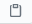

# **EDITOR DE MEMES de Silvina Bordon** 💕
 
Esta aplicación es un editor para generar memes donde puedes manipular el texto, la imagen, y diferentes propiedades. Cuando quedes conforme puedes descargar tu meme para usarlo y compartirlo donde quieras. Ahora a disfrutarlo 🎉

#### Si quieres verlo puedes hacer click en este [enlace](https://silbordon.github.io/Proyecto-MEMES/).

***


## **Instalación** 👈🏻

### Para clonar este repositorio tienes que seguir estos pasos:

<br>

 - Ir al [repositorio](https://github.com/Silbordon/Proyecto-MEMES)  
 - Hacer click al botón de 
 - Hacer click al botón de 

 - Copiar la URL haciendo click al boton 
 - Abrir tu terminal y poner el comando de 
   ```
   git clone <url> 
   ```
 - Entrar a la carpeta del proyecto y abrirlo en tu IDE


<br>


### **Asi es como se debería ver el Proyecto**

<br>


<br>

***

## **Pseudocódigo sección URL de la imagen**

### **¿Cómo logramos que al poner el texto en el input Superior se pinte en la seccion TopText en el contenedor del meme?**
<br>

### *Variables* ###

- A: Contenedor del Textarea "Superior"
- B: Contenedor de Top Text

### *Pseudocodigo* ###
- Inicio 
- Identificar cuando el usuario ingrese el texto.
- Guardar el valor que ingresó el usuario
- Identificar el lugar donde se pintara el nuevo texto. 
- Pintamos el nuevo texto en el contenedor de Top Text. 
- Fin 


## **Agradecimiento** 🥰😘

- Quiero agradecer a nuestro profe [Jonh](https://github.com/Jonhks) y a [Leydy](https://github.com/leydyk93) por su paciencia y ayuda constante para que podamos aprender, y a todas mis compañeras por el apoyo diario.


- A mi esposo por ser mi soporte todos los dias, recordandome que nunca es tarde para aprender cosas nuevas y por ayudarme a recorrer el maravilloso mundo de la programación.


#### *De Silvi con ❤*
